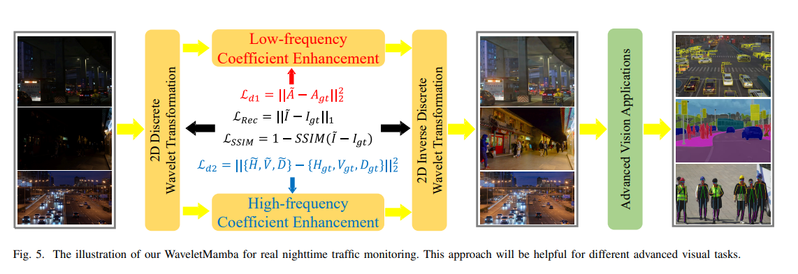
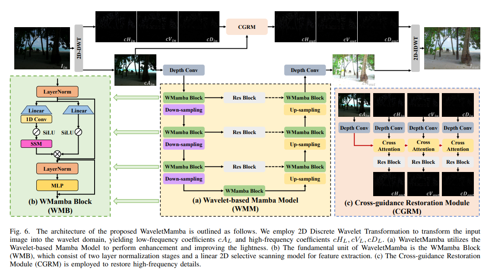
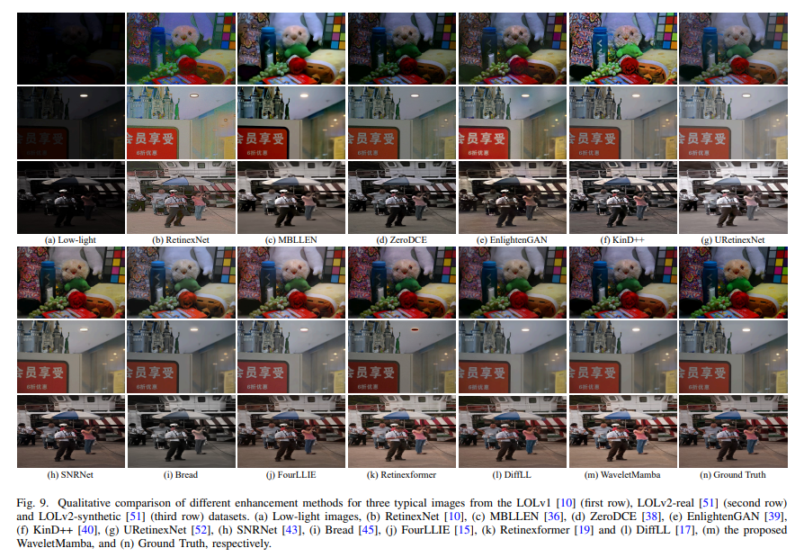
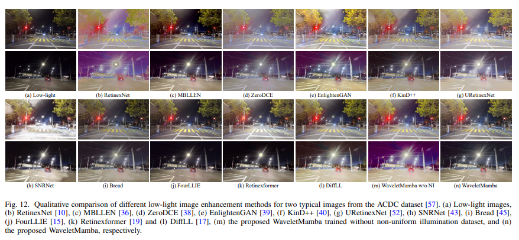

# Wavelet-based Mamba Model

The implementation of "WaveletMamba: Wavelet-based Mamba for Low-light Image Enhancement with Nighttime Non-uniform Illumination Traffic Driving Dataset"

 
 

## Prerequisites
```
pip install -r requirements.txt
````

## Quick Start

### Download the training and evaluation datasets

You can refer to the following links to download the dataset, 
[LOLv1](https://daooshee.github.io/BMVC2018website/ "LOLv1").
[LOLv2](https://github.com/flyywh/CVPR-2020-Semi-Low-Light "LOLv2"). 
[LSRW](https://github.com/JianghaiSCU/R2RNet "LSRW").
[DICM][LIME][MEF][NPE][VV](https://github.com/mingcv/Bread "Tesing dataset")

### Description

Our PSNR/SSIM/LPIPS/NIQE on different test sets:

 
 

### Training

***You can train data using:***

```python train.py```
	
### Testing

**We provide a pre-trained model.**

***You can test paired data using:***

```python test.py```

 
 


